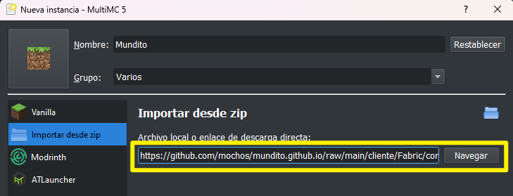

# 🙋 ¡Bienvenido!

[](https://stats.uptimerobot.com/vpbB3Zq4A4) [](https://stats.uptimerobot.com/vpbB3Zq4A4)

Survival vanilla con plugins compatible con Java 1.20.1 y Bedrock.

### 🎮 ¿Cómo jugar?

Para entrar en Mundito debes haber sido invitado por uno de los pioneros. Solicita a la persona que te invitó que te de acceso.

Puedes entrar con tu Minecraft Bedrock (PC, celular o consolas) o Minecraft Vanilla en PC pero si eres usuario de Java te dejamos algunos mods recomendados que agregan mejoras a tu experiencia como shaders, paquetes de recursos, animaciones, mapa, etc.



Si usas el launcher [MultiMC o PolyMC](./#launchers-recomendados-java), puedes instalar la instancia directamente desde url o descargando el archivo zip.


Esta instalación incluye la versión de Java necesaria instalada y configurada.



En ambos métodos de instalación es importante que dejes el nombre predeterminado de la instancia: _"Mundito"_


* **Instalar por enlace de descarga directa (Método recomendado):**

Ve al launcher, dale _\[Nueva instancia]_, _\[Importar desde zip]_ y pega el siguiente texto en el campo _"Archivo local o enlace de descarga directa"._

```
https://github.com/mochos/mundito.github.io/raw/refs/heads/main/cliente/Fabric/Mundito.zip
```

<figure><figcaption></figcaption></figure>

* **Instalar por archivo local:**

Descarga el siguiente archivo y arrástralo a la ventana principal del launcher. Si necesitas ayuda mira las [instrucciones detalladas](informacion/ayuda.md#como-instalar-la-instancia-de-mundito-en-multimc-o-polymc).





Para jugar desde Bedrock de Windows, iOS o Android dale clic a [este enlace](minecraft://?addExternalServer=Mundito|mundito.mochos.xyz:19132) para conectarte al Mundito o configura la ip manualmente:&#x20;

IP y puerto para Bedrock

```
mundito.mochos.xyz
```

```
19132
```

Para jugar desde Bedrock de consolas mira [este tutorial](informacion/ayuda.md#como-jugar-desde-consola).



Si usas cualquier otro launcher, descarga los archivos para extraer en la carpeta _".minecraft"_ en tu instalación de [Fabric](https://fabricmc.net/use/installer/) (0.15.11+).


**¡IMPORTANTE!**

* Tener instalado Fabric. No funciona en Forge ni Vanilla.
* Es necesario que tengas la [versión 17 de Java](informacion/ayuda.md#como-configuro-java-en-polymc-y-multimc).






Si algo no funciona bien o sale algún error inesperado, consulta la [sección de ayuda](informacion/ayuda.md).

### 🚀 Launchers recomendados (Java)

<table data-card-size="large" data-view="cards"><thead><tr><th></th><th></th><th></th><th data-hidden data-card-cover data-type="files"></th></tr></thead><tbody><tr><td><h4>MultiMC</h4></td><td><p>Para jugadores premium (Tienen el juego comprado).</p><p><br><a href="https://multimc.org/#Download">⬇️ Descarga oficial</a></p></td><td></td><td><a href=".gitbook/assets/multimc.png">multimc.png</a></td></tr><tr><td><h4>PolyMC</h4></td><td><p>Launcher para jugadores no premium (No tienen el juego comprado).</p><p><br><a href="https://polymc.org/download/">⬇️ Descarga oficial</a></p></td><td></td><td><a href=".gitbook/assets/polymc.png">polymc.png</a></td></tr></tbody></table>
