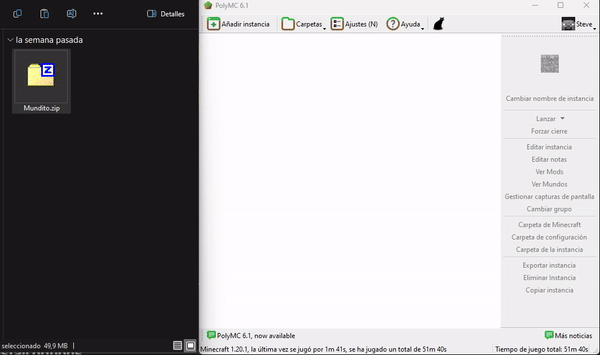
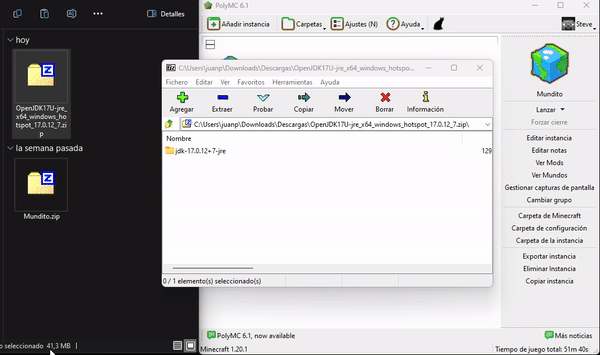
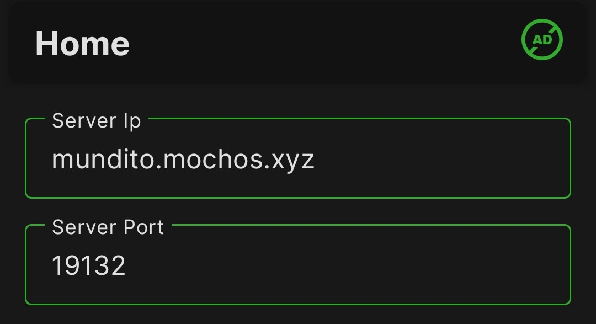

# 🆘 Ayuda

### ¿Cómo instalar la instancia de mundito en MultiMC o PolyMC?

1. Descarga el [zip de la instancia](../#mods-recomendados-java).
2. Abre el launcher.
3. Arrastra el zip descargado a la ventana del launcher.
4. En la ventana que se abre dale al botón \[OK].

<figure><figcaption></figcaption></figure>

### ¿Cómo configuro Java en PolyMC y MultiMC?

Para **PolyMC y MultiMC** ya viene configurado directamente en la instancia. Pero si algo sale mal, sigue las instrucciones a continuación:

1. Descargas el siguiente zip de Java:


Fuente: [adoptium.net](https://adoptium.net/temurin/releases/?os=windows\&package=jre\&version=17)


2. Extraes su contenido en cualquier carpeta. Debes tener en cuenta que la ubicación donde lo extraigas debe ser la definitiva.
3. Vas a la configuración del launcher, buscas el apartado Java. En la ruta de acceso Java le das en \[...]
4. En la ventana que aparece buscas el ejecutable `javaw.exe` que está dentro de la carpeta `bin` en la carpeta que extrajiste. Una vez seleccionado le das abrir y una vez configurado puedes cerrar esa ventana de configuración.

<figure><figcaption></figcaption></figure>

### ¿Cómo instalar los mods y configurar Java en cualquier otro launcher?

No se parce. Para instalar el Java te sirven los puntos 1 y 2 pero de ahí en adelante puede variar la configuración para cada launcher. Para instalar mods también depende de cada launcher.

Mira que te conseguí los launchers premium y no premium más sencillos de configurar y encima te hice tutoriales bien detallados con videíto y todo para facilitarte la vida.

Si vas de rebelde y te querés complicar usando cualquier otro launcher, te toca resolver por tu cuenta. 😅 En YouTube hay un montón de tutoriales.

### ¿Cómo ocultar contraseña en stream?

El modpack sugerido incluye un mod de macros al que le puedes asignar comandos. Para evitar que tu `/login` se vea en stream configura un macro para ejecutar el comando de la siguiente forma:

1. Busca en la configuración de controles esta configuración y asígnale una tecla.


2. Con esa tecla asignada abres la configuración de macros. En esta pantalla dale al botón "Add Macro"


3. Luego despliega el macro que acabas de crear y pone tu comando `/login <contraseña>`, asígnale una tecla y dale "Save & Exit"


4. Cuando entres Mundito solo presionas la tecla asignada al macro y este comando se ejecutará en silencio. Si ya expusiste tu contraseña, usa el comando `/changepass <antigua contraseña> <nueva contraseña>` para cambiarla.

### Problemas comunes

| Problema                                                                                                                    | Solución                                                                                                                                                                                                                                                        |
| --------------------------------------------------------------------------------------------------------------------------- | --------------------------------------------------------------------------------------------------------------------------------------------------------------------------------------------------------------------------------------------------------------- |
| <p>Crashea con este error en consola:<br><code>Minecraft 1.18 Pre Release 2 and above require the use of Java 17</code></p> | Actualiza tu instalación de Java. Descarga el instalador [en este enlace](https://www.oracle.com/java/technologies/downloads/#jdk22-windows). El que dice "**x64 Installer**". Luego configura la ruta de acceso de Java en el launcher con esta nueva versión. |
| <p>Al tratar de entrar al servidor te bloquea con el mensaje:<br><code>You are not whitelisted on this server!</code></p>   | Si fuiste invitado al servidor y te sale esto, contacta a algún admin o streamer de Mundito o a la persona que te invitó. Si no sabes a quién contactar, es la razón por la que no fuiste invitado. :v                                                          |

### ¿Por qué no puedo ver las skins personalizadas de Mundito?


Las skins personalizadas no funcionan en Minecraft Bedrock


Las skins de del servidor funcionan con el mod [**OfflineSkins**](https://www.curseforge.com/minecraft/mc-mods/offlineskins) para Minecraft Java configurado para cargar las skins desde nuestro servidor propio.

El mod y ya configuración vienen incluidas en la descarga de [mods recomendados](../#mods-recomendados-java).

Si tienes el mod pero no está configurado con nuestro servidor de skins, puedes configurarlo directamente reemplazando en el archivo `".minecraft\config\offlineskins.json"` por este:



o cambiando todo su contenido por esto:

```json
{
  "useMojang": true,
  "useCrafatar": false,
  "useCustomServer": false,
  "hostCustomServer": "http://example.com",
  "useCustomServer2": true,
  "hostCustomServer2Skin": "https://raw.githubusercontent.com/mochos/mochos.github.io/main/skins/skins/%name%.png",
  "hostCustomServer2Cape": "https://raw.githubusercontent.com/mochos/mochos.github.io/main/skins/capes/%name%.png"
}
```


### ¿Cómo jugar desde consola?

Debes seguir los pasos del video a continuación poniendo en esa app la ip y el puerto de Mundito:

<figure><figcaption></figcaption></figure>


