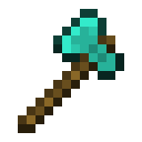
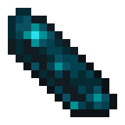

# 👾 Mecánicas exclusivas

Esta es una lista de objetos y funcionalidades creadas exclusivamente para Mundito

### Sistema económico

La moneda del Mundito es el Ceitil. Con esta moneda se hacen los intercambios económicos con NPCs, ciudades y entre jugadores.

El Ceitil está basado en las esmeraldas y sólo los alcaldes pueden emitirla para mantener un control estable de la economía. Los jugadores pueden llevar el dinero en su inventario o en sus cuentas bancarias. [Más info de comandos](comandos.md#essentialsx).

Cada ciudad tiene una sucursal del Banco Central en la que los ciudadanos pueden consultar su saldo, ver estadísticas económicas y hacer transacciones.

### Herramientas

Estas se pueden comprar en la tienda del spawn.

<table data-header-hidden><thead><tr><th width="220"></th><th></th></tr></thead><tbody><tr><td></td><td><strong>Instaminador</strong> Rompe un radio de 3x3 bloques. No reparable - No encantable. Disponible con y sin eficiencia 5</td></tr><tr><td></td><td>
<strong>Brisa Tempestuosa</strong> Infringe más daño al atacar en caída. Evita el daño por caída desde alturas no letales.

Úsala para impulsarte hacia arriba. No reparable - No encantable.
</td></tr><tr><td></td><td>
<strong>Lanzacohetes</strong>

Causa una explosión en el punto de impacto.

Empuja entidades al explotar.

Durabilidad limitada / Cooldown de 10 segundos. No reparable - No encantable.
</td></tr><tr><td></td><td><strong>Cofre de ender portátil</strong> Te permite abrir tu cofre de ender de forma remota. Un solo uso.</td></tr><tr><td></td><td><strong>Gema de compromiso</strong> Úsala para comprometerte con tu pareja. Prepara tu boda y busca un cura para casarte. Al estar casados obtienen ventajas. <mark style="color:yellow;">(Próximamente...)</mark></td></tr></tbody></table>

### Fuente de los deseos


Próximamente


### Matrimonio


Próximamente


Te puedes casar con otro jugador para obtener algunos beneficios:

* Mientras estés cerca de tu pareja ambos obtienen constantemente regeneración, prisa minera y fuerza.
* Tienen acceso a [comandos especiales](comandos.md#matrimonio) para parejas que brindan funcionalidades exclusivas.

Para casarse deben tener cada uno una Gema de compromiso que se consigue en la tienda del spawn. Para la ceremonia necesitan preparar un lugar especial y buscar un cura para que celebre la unión oficialmente.
